# ТЗ: Лендинг «Чеховский» с адаптивным калькулятором и сквозной рекламной воронкой

Дата: 2026-03-04  
Статус: релизно-готовая версия (аудит-дельта интегрирована)

## 1. Задача проекта

Сделать лендинг, который:
1. Персонализирует ценностное сообщение под 3 ключевых аватара через выбор сценария в начале.
2. Ведет клиента от рекламного креатива к преднастроенному калькулятору и дальше к целевому действию без потери смысла.
3. Сохраняет единое бренд-ядро `с любовью от Чеховского` во всех ветках коммуникации.
4. Усиливает конверсию в звонок и переход в старый сайт с корзиной.

## 2. Аудит текущих наработок и рынка

### 2.1 Подтвержденные факты по текущему ассортиментному контуру

1. В SKU-контуре: `139` карточек, `13,247` визитов, `69` форм, общий `CR формы 0.52%`.
2. Самый трафиковый раздел: `zakuski` (`5,744` визита), но слабый `CR формы 0.44%`.
3. По SKU-разделам нет прозрачного `checkout_begin` в аналитике по секциям, поэтому мост в целевое действие критичен.

### 2.2 Подтвержденные факты по конкуренту (IK-Catering)

1. Конкурент сильный в первом касании: оффер, цена, пороги доставки, понятный CTA.
2. У конкурента быстрее считывается «что делать дальше».
3. Наш шанс на отстройку: локальность, персонализация по аватарам, бренд-доверие и сквозная аналитика.

### 2.3 Вывод аудита

Нужна full-funnel модель: `креатив -> калькулятор -> карточка -> действие`, где на каждом шаге клиент видит непрерывную ценность и получает теплое, понятное сопровождение брендом.

## 3. Бренд-ядро и языковые правила

### 3.1 Непереговорные принципы

1. Формула `с любовью от Чеховского` обязательна во всех аватарных ветках.
2. `Слово Чеховского` используется как proof надежности и тайминга.
3. `Штамп заботы` используется как proof аккуратности и контроля качества.
4. Формулировки с `эпилог` не используются.

### 3.2 Правило мутации бренд-ядра

Базовая часть не меняется: `с любовью от Чеховского`.  
Меняется только контекстный хвост под аватар.

Шаблон:
`с любовью от Чеховского + [контекстная выгода]`

Примеры:
1. `с любовью от Чеховского к семейному столу`
2. `с любовью от Чеховского к вашему рабочему ритму`
3. `с любовью от Чеховского к важным гостям и подаче`

### 3.3 Миссия, видение и маркеры 2026-2029

1. Миссия в продукте: давать теплый и надежный сервис без стресса выбора.
2. Видение: стать эталоном интеллигентной кулинарии по сочетанию вкуса, сервиса и предсказуемости.
3. Рейтинг (долгий контур): `>= 4.8`.
4. NPS (долгий контур): `>= 60`.
5. Repeat ПП (долгий контур): `>= 40% / 30 дней`.
6. Доля вечерних наборов (долгий контур): `25-30%`.

## 4. Аватары и ценностный язык

### 4.1 Аватар A: семейное событие

1. Боль: «хочу красиво и без суеты».
2. Язык ценности: тепло, простота, уверенность.
3. Hero: `Праздничный стол без суеты, с любовью от Чеховского к семейному событию.`
4. CTA: `Подобрать набор за 2 минуты`.

### 4.2 Аватар B: офис/команда

1. Боль: «нужно вовремя, в бюджет, без провала».
2. Язык ценности: функциональность, прогнозируемость.
3. Hero: `Решение для офиса по сроку и бюджету, с любовью от Чеховского к вашему рабочему ритму.`
4. CTA: `Получить расчет для команды`.

### 4.3 Аватар C: руководитель/важные гости

1. Боль: «нужно статусно и без ошибок».
2. Язык ценности: контроль, качество подачи, надежность.
3. Hero: `Подача, за которую спокойно перед руководителем, с любовью от Чеховского к вашим важным гостям.`
4. CTA: `Согласовать сценарий с менеджером`.

### 4.4 Карта соответствия 5 бренд-персон к 3 аватарам лендинга

| Персона из бренд-платформы | Целевой чек | Ветка лендинга | Комментарий по переносу |
|---|---|---|---|
| Офисный спешащий | `900-1200` | `office` | Базовая офисная ветка с SLA и ценой на человека |
| Осознанный едок (ПП) | `900-1300` | `office` | Внутри office отдельный ПП-маркер и зеленые сигналы |
| Ужин без хлопот | `1400-2200` | `family` | Домашний/семейный сценарий с готовыми наборами |
| Сладкоежка/подарок | `600-1600` | `family` и `executive` | Апселл десертов в обеих ветках |
| B2B (офисы/ивенты) | зависит от формата | `executive` и `office` | Executive для статуса, Office для регулярных заказов |

### 4.5 Матрица `аватар -> ценность -> цвет -> CTA`

| Аватар | Ключевая ценность | Цветовой mood | CTA-язык |
|---|---|---|---|
| `family` | Тепло и простота без суеты | бордовый + теплые нейтрали | `Подобрать набор за 2 минуты` |
| `office` | Предсказуемость и контроль бюджета | нейтраль + функциональные акценты, зеленый только для ПП | `Получить расчет для команды` |
| `executive` | Статус и отсутствие ошибок | глубокий бордовый + строгий контраст | `Согласовать сценарий с менеджером` |

## 5. Преднастроенный калькулятор в начале лендинга

### 5.1 Вопрос и режимы входа

Вопрос: `Для кого подбираем ассортимент?`

Режимы:
1. `calc=family`
2. `calc=office`
3. `calc=executive`
4. `calc=all`

### 5.2 Что меняется после выбора

1. Hero-подзаголовок и proof-плашка.
2. Порядок топ-SKU и подписи карточек.
3. CTA-тексты и финальный оффер.
4. Набор кейсов и аргументов доверия.

### 5.3 URL-контракт для рекламы

1. `?calc={family|office|executive|all}`
2. `&ad_hook={speed|care|status|price|combo}`
3. `&utm_content={creative_id}_{calc}_{ad_hook}`

### 5.4 Рекомендованные SKU и Obsidian-превью (коммерческий слой)

Источник: анализ карточек `artifacts/sku-audit/sku_cards.csv` + ранжирование по `appetite_score_data` и коммерческой пригодности.

<table>
  <thead>
    <tr>
      <th>Раздел</th>
      <th>SKU</th>
      <th>Позиция</th>
      <th>Название</th>
      <th>Цена, ₽</th>
      <th>Appetite score</th>
      <th>Роль в лендинге</th>
      <th>Маркер бренда</th>
      <th>Color mode</th>
      <th>Копирайт-угол карточки</th>
      <th>Аудит текущего визуала (фото + бренд)</th>
      <th>Чеклист исправлений (что нужно сделать)</th>
    </tr>
  </thead>
  <tbody>
    <tr><td rowspan="2">Фуршет</td><td rowspan="2"><code>furshetmenu-001</code></td><td rowspan="2">1</td><td>Салат «Восторг»</td><td>1200</td><td>7.04</td><td>Hero-top для family</td><td>Вечерние рассказы</td><td><code>primary-bordo + accent-warm</code></td><td>family: тепло и простота без суеты</td><td>Текущий кадр в целом рабочий, но потенциал роста есть в подаче и съёмочном сценарии. Бренд-корреляция: текущий кадр не всегда явно транслирует маркер «Вечерние рассказы» и нужный color mode.</td><td rowspan="2" style="vertical-align:top; min-width:420px;"><ul><li>[ ] Переснять по плану: Снимайте салат с угла 35–45° и добавьте крупный передний план с фактурой (зелень, соус, зерно продукта).</li><li>[ ] Обновить стайлинг: Добавьте свежий акцент: 2–3 ярких ингредиента сверху (зелень, семечки, тонкий соус-штрих), без перегруза.</li><li>[ ] Сделать постобработку: Постобработка: держите естественную цветокоррекцию без агрессивных фильтров. Кадрируйте так, чтобы блюдо занимало 70–80% площади превью.</li><li>[ ] Применить copy-формулу «польза -> proof -> с любовью от Чеховского» для аватара family.</li><li>[ ] Проверить соответствие color-contract: primary-bordo + accent-warm.</li></ul></td></tr>
    <tr><td colspan="8">
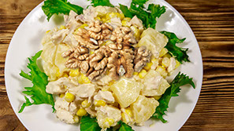
</td></tr>
    <tr><td rowspan="2">Фуршет</td><td rowspan="2"><code>furshetmenu-022</code></td><td rowspan="2">2</td><td>Салат норвежский</td><td>1700</td><td>6.95</td><td>Премиум-альтернатива</td><td>Слово Чеховского</td><td><code>primary-bordo-strong</code></td><td>executive: статус и надежный тайминг</td><td>Сейчас видно, что цвет перенасыщен, картинка кажется неестественной. Бренд-корреляция: текущий кадр не всегда явно транслирует маркер «Слово Чеховского» и нужный color mode.</td><td rowspan="2" style="vertical-align:top; min-width:420px;"><ul><li>[ ] Переснять по плану: Снимайте салат с угла 35–45° и добавьте крупный передний план с фактурой (зелень, соус, зерно продукта).</li><li>[ ] Обновить стайлинг: Добавьте свежий акцент: 2–3 ярких ингредиента сверху (зелень, семечки, тонкий соус-штрих), без перегруза.</li><li>[ ] Сделать постобработку: Постобработка: держите естественную цветокоррекцию без агрессивных фильтров. Кадрируйте так, чтобы блюдо занимало 70–80% площади превью.</li><li>[ ] Применить copy-формулу «польза -> proof -> с любовью от Чеховского» для аватара executive.</li><li>[ ] Проверить соответствие color-contract: primary-bordo-strong.</li></ul></td></tr>
    <tr><td colspan="8">
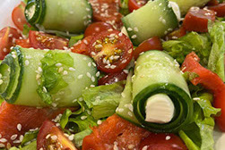
</td></tr>
    <tr><td rowspan="2">Фуршет</td><td rowspan="2"><code>furshetmenu-013</code></td><td rowspan="2">3</td><td>Гнездо глухаря (слоеный)</td><td>1400</td><td>6.94</td><td>Баланс цена/вид</td><td>Штамп заботы</td><td><code>primary-bordo + neutral-surface</code></td><td>family: аккуратность и доверие</td><td>Текущий кадр в целом рабочий, но потенциал роста есть в подаче и съёмочном сценарии. Бренд-корреляция: текущий кадр не всегда явно транслирует маркер «Штамп заботы» и нужный color mode.</td><td rowspan="2" style="vertical-align:top; min-width:420px;"><ul><li>[ ] Переснять по плану: Соберите кадр так, чтобы главный ингредиент занимал визуальный центр и был самым резким объектом.</li><li>[ ] Обновить стайлинг: Держите композицию простой: один главный герой и 1–2 поддерживающих акцента.</li><li>[ ] Сделать постобработку: Постобработка: держите естественную цветокоррекцию без агрессивных фильтров. Кадрируйте так, чтобы блюдо занимало 70–80% площади превью.</li><li>[ ] Применить copy-формулу «польза -> proof -> с любовью от Чеховского» для аватара family.</li><li>[ ] Проверить соответствие color-contract: primary-bordo + neutral-surface.</li></ul></td></tr>
    <tr><td colspan="8">
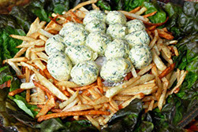
</td></tr>
    <tr><td rowspan="2">Горячее</td><td rowspan="2"><code>hot-013</code></td><td rowspan="2">1</td><td>Голень индейки запеченная</td><td>990</td><td>7.83</td><td>Точка входа в горячее</td><td>Слово Чеховского</td><td><code>neutral-surface + primary-bordo</code></td><td>office: вовремя и предсказуемо</td><td>Текущий кадр в целом рабочий, но потенциал роста есть в подаче и съёмочном сценарии. Бренд-корреляция: текущий кадр не всегда явно транслирует маркер «Слово Чеховского» и нужный color mode.</td><td rowspan="2" style="vertical-align:top; min-width:420px;"><ul><li>[ ] Переснять по плану: Для горячего мяса нужен боковой тёплый свет, чтобы показать корочку, сок и текстуру обжарки.</li><li>[ ] Обновить стайлинг: Подложка должна быть нейтральной и тёплой; добавьте минимальный гарнир, чтобы подчеркнуть порцию, а не отвлекать.</li><li>[ ] Сделать постобработку: Постобработка: держите естественную цветокоррекцию без агрессивных фильтров. Кадрируйте так, чтобы блюдо занимало 70–80% площади превью.</li><li>[ ] Применить copy-формулу «польза -> proof -> с любовью от Чеховского» для аватара office.</li><li>[ ] Проверить соответствие color-contract: neutral-surface + primary-bordo.</li></ul></td></tr>
    <tr><td colspan="8">
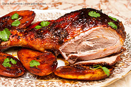
</td></tr>
    <tr><td rowspan="2">Горячее</td><td rowspan="2"><code>hot-015</code></td><td rowspan="2">2</td><td>Сотэ из баклажанов</td><td>1100</td><td>7.82</td><td>Ветка office/PP-подача</td><td>Легкий жанр</td><td><code>pp-green + neutral-surface</code></td><td>office: ПП-выбор без шума</td><td>Сейчас видно, что цвет перенасыщен, картинка кажется неестественной. Бренд-корреляция: текущий кадр не всегда явно транслирует маркер «Легкий жанр» и нужный color mode.</td><td rowspan="2" style="vertical-align:top; min-width:420px;"><ul><li>[ ] Переснять по плану: Для горячего мяса нужен боковой тёплый свет, чтобы показать корочку, сок и текстуру обжарки.</li><li>[ ] Обновить стайлинг: Подложка должна быть нейтральной и тёплой; добавьте минимальный гарнир, чтобы подчеркнуть порцию, а не отвлекать.</li><li>[ ] Сделать постобработку: Постобработка: поднимите экспозицию и локальные тени. Кадрируйте так, чтобы блюдо занимало 70–80% площади превью.</li><li>[ ] Применить copy-формулу «польза -> proof -> с любовью от Чеховского» для аватара office.</li><li>[ ] Проверить соответствие color-contract: pp-green + neutral-surface.</li></ul></td></tr>
    <tr><td colspan="8">
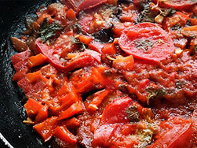
</td></tr>
    <tr><td rowspan="2">Горячее</td><td rowspan="2"><code>hot-019</code></td><td rowspan="2">3</td><td>Крылышки в медовом соусе во фритюре</td><td>1100</td><td>7.82</td><td>Эмоциональный драйвер вкуса</td><td>Вечерние рассказы</td><td><code>primary-bordo + accent-warm</code></td><td>family: эмоциональный вкус для компании</td><td>Сейчас видно, что цвет перенасыщен, картинка кажется неестественной. Бренд-корреляция: текущий кадр не всегда явно транслирует маркер «Вечерние рассказы» и нужный color mode.</td><td rowspan="2" style="vertical-align:top; min-width:420px;"><ul><li>[ ] Переснять по плану: Для горячего мяса нужен боковой тёплый свет, чтобы показать корочку, сок и текстуру обжарки.</li><li>[ ] Обновить стайлинг: Подложка должна быть нейтральной и тёплой; добавьте минимальный гарнир, чтобы подчеркнуть порцию, а не отвлекать.</li><li>[ ] Сделать постобработку: Постобработка: держите естественную цветокоррекцию без агрессивных фильтров. Кадрируйте так, чтобы блюдо занимало 70–80% площади превью.</li><li>[ ] Применить copy-формулу «польза -> proof -> с любовью от Чеховского» для аватара family.</li><li>[ ] Проверить соответствие color-contract: primary-bordo + accent-warm.</li></ul></td></tr>
    <tr><td colspan="8">
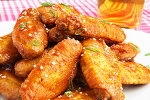
</td></tr>
    <tr><td rowspan="2">Закуски</td><td rowspan="2"><code>zakuski-001</code></td><td rowspan="2">1</td><td>Канапе на выбор</td><td>120</td><td>6.92</td><td>Массовый вход (высокий спрос)</td><td>Слово Чеховского</td><td><code>neutral-surface + primary-bordo</code></td><td>office: быстрое решение для команды</td><td>Текущий кадр в целом рабочий, но потенциал роста есть в подаче и съёмочном сценарии. Бренд-корреляция: текущий кадр не всегда явно транслирует маркер «Слово Чеховского» и нужный color mode.</td><td rowspan="2" style="vertical-align:top; min-width:420px;"><ul><li>[ ] Переснять по плану: Для закусок соберите ритм из 5–7 элементов в кадре и оставьте один «геройский» элемент в резком фокусе.</li><li>[ ] Обновить стайлинг: Выровняйте геометрию подачи: одинаковые интервалы, чистые края тарелки, один цветовой акцент.</li><li>[ ] Сделать постобработку: Постобработка: держите естественную цветокоррекцию без агрессивных фильтров. Кадрируйте так, чтобы блюдо занимало 70–80% площади превью.</li><li>[ ] Применить copy-формулу «польза -> proof -> с любовью от Чеховского» для аватара office.</li><li>[ ] Проверить соответствие color-contract: neutral-surface + primary-bordo.</li></ul></td></tr>
    <tr><td colspan="8">
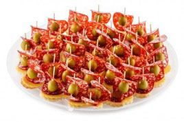
</td></tr>
    <tr><td rowspan="2">Закуски</td><td rowspan="2"><code>zakuski-023</code></td><td rowspan="2">2</td><td>Сет рыбный</td><td>1400</td><td>6.87</td><td>Средний чек и презентабельность</td><td>Штамп заботы</td><td><code>primary-bordo-strong + neutral-surface</code></td><td>executive: статусная подача и контроль качества</td><td>Сейчас видно, что цвет перенасыщен, картинка кажется неестественной. Бренд-корреляция: текущий кадр не всегда явно транслирует маркер «Штамп заботы» и нужный color mode.</td><td rowspan="2" style="vertical-align:top; min-width:420px;"><ul><li>[ ] Переснять по плану: Для рыбы важно показать сочность среза: снимайте на уровне блюда и добавьте точку блеска на поверхности.</li><li>[ ] Обновить стайлинг: Уберите лишний декор; оставьте 1–2 элемента (лимон/зелень), чтобы не спорить с цветом рыбы.</li><li>[ ] Сделать постобработку: Постобработка: держите естественную цветокоррекцию без агрессивных фильтров. Кадрируйте так, чтобы блюдо занимало 70–80% площади превью.</li><li>[ ] Применить copy-формулу «польза -> proof -> с любовью от Чеховского» для аватара executive.</li><li>[ ] Проверить соответствие color-contract: primary-bordo-strong + neutral-surface.</li></ul></td></tr>
    <tr><td colspan="8">
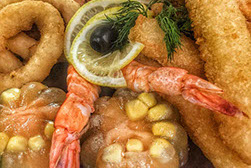
</td></tr>
    <tr><td rowspan="2">Закуски</td><td rowspan="2"><code>zakuski-017</code></td><td rowspan="2">3</td><td>Закуска Роллы с курицей</td><td>160</td><td>6.62</td><td>Быстрый выбор для офиса</td><td>Вечерние рассказы</td><td><code>neutral-surface + primary-bordo</code></td><td>office: удобная сборка без перегруза</td><td>Текущий кадр в целом рабочий, но потенциал роста есть в подаче и съёмочном сценарии. Бренд-корреляция: текущий кадр не всегда явно транслирует маркер «Вечерние рассказы» и нужный color mode.</td><td rowspan="2" style="vertical-align:top; min-width:420px;"><ul><li>[ ] Переснять по плану: Для горячего мяса нужен боковой тёплый свет, чтобы показать корочку, сок и текстуру обжарки.</li><li>[ ] Обновить стайлинг: Подложка должна быть нейтральной и тёплой; добавьте минимальный гарнир, чтобы подчеркнуть порцию, а не отвлекать.</li><li>[ ] Сделать постобработку: Постобработка: держите естественную цветокоррекцию без агрессивных фильтров. Кадрируйте так, чтобы блюдо занимало 70–80% площади превью.</li><li>[ ] Применить copy-формулу «польза -> proof -> с любовью от Чеховского» для аватара office.</li><li>[ ] Проверить соответствие color-contract: neutral-surface + primary-bordo.</li></ul></td></tr>
    <tr><td colspan="8">
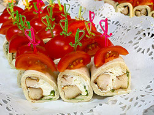
</td></tr>
    <tr><td rowspan="2">Десерты</td><td rowspan="2"><code>desert-002</code></td><td rowspan="2">1</td><td>Тарталетки лесная ягода</td><td>150</td><td>6.72</td><td>Финальный штрих от Чеховского</td><td>Финальный штрих от Чеховского</td><td><code>primary-bordo + accent-warm</code></td><td>family: теплое завершение стола</td><td>Сейчас видно, что белый/пустой фон забирает слишком много внимания; цвет блюда выглядит блекло и «плоско». Бренд-корреляция: текущий кадр не всегда явно транслирует маркер «Финальный штрих от Чеховского» и нужный color mode.</td><td rowspan="2" style="vertical-align:top; min-width:420px;"><ul><li>[ ] Переснять по плану: Для десертов используйте мягкий рассеянный свет и кадр с крошкой/срезом, чтобы передать текстуру крема и бисквита.</li><li>[ ] Обновить стайлинг: Фон спокойный, но не стерильный: дерево/текстиль в мягком боке усиливает ощущение «домашнего вкуса».</li><li>[ ] Сделать постобработку: Постобработка: аккуратно усилите насыщенность тёплых оттенков (+6..+12). Кадрируйте так, чтобы блюдо занимало 70–80% площади превью.</li><li>[ ] Применить copy-формулу «польза -> proof -> с любовью от Чеховского» для аватара family.</li><li>[ ] Проверить соответствие color-contract: primary-bordo + accent-warm.</li></ul></td></tr>
    <tr><td colspan="8">
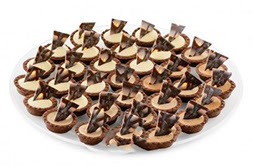
</td></tr>
    <tr><td rowspan="2">Десерты</td><td rowspan="2"><code>desert-003</code></td><td rowspan="2">2</td><td>Тирамсу</td><td>150</td><td>6.72</td><td>Узнаваемый десерт в top</td><td>Финальный штрих от Чеховского</td><td><code>primary-bordo-strong + accent-warm</code></td><td>executive: элегантный десертный финал</td><td>Сейчас видно, что белый/пустой фон забирает слишком много внимания. Бренд-корреляция: текущий кадр не всегда явно транслирует маркер «Финальный штрих от Чеховского» и нужный color mode.</td><td rowspan="2" style="vertical-align:top; min-width:420px;"><ul><li>[ ] Переснять по плану: Для десертов используйте мягкий рассеянный свет и кадр с крошкой/срезом, чтобы передать текстуру крема и бисквита.</li><li>[ ] Обновить стайлинг: Фон спокойный, но не стерильный: дерево/текстиль в мягком боке усиливает ощущение «домашнего вкуса».</li><li>[ ] Сделать постобработку: Постобработка: слегка опустите экспозицию (-0.2..-0.4 EV). Кадрируйте так, чтобы блюдо занимало 70–80% площади превью.</li><li>[ ] Применить copy-формулу «польза -> proof -> с любовью от Чеховского» для аватара executive.</li><li>[ ] Проверить соответствие color-contract: primary-bordo-strong + accent-warm.</li></ul></td></tr>
    <tr><td colspan="8">
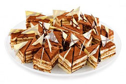
</td></tr>
    <tr><td rowspan="2">Десерты</td><td rowspan="2"><code>desert-012</code></td><td rowspan="2">3</td><td>Тарталетки с грецким орехом</td><td>150</td><td>6.68</td><td>Вариант для mixed-входа</td><td>Финальный штрих от Чеховского</td><td><code>primary-bordo + accent-warm</code></td><td>family: уютный сладкий акцент</td><td>Сейчас видно, что белый/пустой фон забирает слишком много внимания. Бренд-корреляция: текущий кадр не всегда явно транслирует маркер «Финальный штрих от Чеховского» и нужный color mode.</td><td rowspan="2" style="vertical-align:top; min-width:420px;"><ul><li>[ ] Переснять по плану: Для десертов используйте мягкий рассеянный свет и кадр с крошкой/срезом, чтобы передать текстуру крема и бисквита.</li><li>[ ] Обновить стайлинг: Фон спокойный, но не стерильный: дерево/текстиль в мягком боке усиливает ощущение «домашнего вкуса».</li><li>[ ] Сделать постобработку: Постобработка: слегка опустите экспозицию (-0.2..-0.4 EV). Кадрируйте так, чтобы блюдо занимало 70–80% площади превью.</li><li>[ ] Применить copy-формулу «польза -> proof -> с любовью от Чеховского» для аватара family.</li><li>[ ] Проверить соответствие color-contract: primary-bordo + accent-warm.</li></ul></td></tr>
    <tr><td colspan="8">
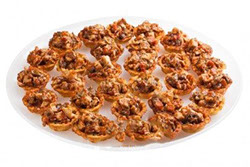
</td></tr>
    <tr><td rowspan="2">Напитки</td><td rowspan="2"><code>napitki-017</code></td><td rowspan="2">1</td><td>Морс Брусничный</td><td>350</td><td>6.69</td><td>Top напиток с ценой</td><td>Штамп заботы</td><td><code>neutral-surface + primary-bordo</code></td><td>family: понятное дополнение к набору</td><td>Сейчас видно, что белый/пустой фон забирает слишком много внимания. Бренд-корреляция: текущий кадр не всегда явно транслирует маркер «Штамп заботы» и нужный color mode.</td><td rowspan="2" style="vertical-align:top; min-width:420px;"><ul><li>[ ] Переснять по плану: Для напитков снимайте не упаковку, а напиток в подаче: стакан, лед, капли конденсата, свежий ингредиент рядом.</li><li>[ ] Обновить стайлинг: Сцена должна быть «живая»: напиток в бокале + ингредиент + текстура поверхности, а не каталог упаковки.</li><li>[ ] Сделать постобработку: Постобработка: слегка опустите экспозицию (-0.2..-0.4 EV), аккуратно усилите насыщенность тёплых оттенков (+6..+12). Кадрируйте так, чтобы блюдо занимало 70–80% площади превью.</li><li>[ ] Применить copy-формулу «польза -> proof -> с любовью от Чеховского» для аватара family.</li><li>[ ] Проверить соответствие color-contract: neutral-surface + primary-bordo.</li></ul></td></tr>
    <tr><td colspan="8">
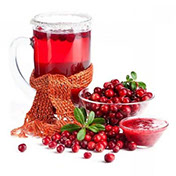
</td></tr>
    <tr><td rowspan="2">Напитки</td><td rowspan="2"><code>napitki-005</code></td><td rowspan="2">2</td><td>Сок морковный свежевыжатый</td><td>250</td><td>5.7</td><td>Офисный функциональный выбор</td><td>Легкий жанр</td><td><code>pp-green + neutral-surface</code></td><td>office: функциональный ПП-напиток</td><td>Сейчас видно, что белый/пустой фон забирает слишком много внимания. Бренд-корреляция: текущий кадр не всегда явно транслирует маркер «Легкий жанр» и нужный color mode.</td><td rowspan="2" style="vertical-align:top; min-width:420px;"><ul><li>[ ] Переснять по плану: Для напитков снимайте не упаковку, а напиток в подаче: стакан, лед, капли конденсата, свежий ингредиент рядом.</li><li>[ ] Обновить стайлинг: Сцена должна быть «живая»: напиток в бокале + ингредиент + текстура поверхности, а не каталог упаковки.</li><li>[ ] Сделать постобработку: Постобработка: слегка опустите экспозицию (-0.2..-0.4 EV). Кадрируйте так, чтобы блюдо занимало 70–80% площади превью.</li><li>[ ] Применить copy-формулу «польза -> proof -> с любовью от Чеховского» для аватара office.</li><li>[ ] Проверить соответствие color-contract: pp-green + neutral-surface.</li></ul></td></tr>
    <tr><td colspan="8">

</td></tr>
    <tr><td rowspan="2">Напитки</td><td rowspan="2"><code>napitki-018</code></td><td rowspan="2">3</td><td>Морс Клюквенный</td><td>350</td><td>5.93</td><td>Парный напиток к сетам</td><td>Штамп заботы</td><td><code>neutral-surface + primary-bordo</code></td><td>family: базовый напиток к сету</td><td>Сейчас видно, что белый/пустой фон забирает слишком много внимания; цвет блюда выглядит блекло и «плоско»; это фото дублируется в других SKU, уникальность карточки падает. Бренд-корреляция: текущий кадр не всегда явно транслирует маркер «Штамп заботы» и нужный color mode.</td><td rowspan="2" style="vertical-align:top; min-width:420px;"><ul><li>[ ] Переснять по плану: Для напитков снимайте не упаковку, а напиток в подаче: стакан, лед, капли конденсата, свежий ингредиент рядом.</li><li>[ ] Обновить стайлинг: Сцена должна быть «живая»: напиток в бокале + ингредиент + текстура поверхности, а не каталог упаковки.</li><li>[ ] Сделать постобработку: Постобработка: слегка опустите экспозицию (-0.2..-0.4 EV), аккуратно усилите насыщенность тёплых оттенков (+6..+12). Кадрируйте так, чтобы блюдо занимало 70–80% площади превью.</li><li>[ ] Применить copy-формулу «польза -> proof -> с любовью от Чеховского» для аватара family.</li><li>[ ] Проверить соответствие color-contract: neutral-surface + primary-bordo.</li></ul></td></tr>
    <tr><td colspan="8">
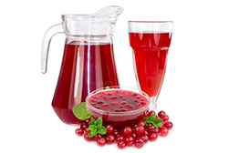
</td></tr>
  </tbody>
</table>

### 5.5 Корреляция SKU с брендбуком (обязательный слой)

Проблема прошлой версии:
1. Таблица выше ранжировала в основном по коммерческим сигналам (вкусность/цена/роль), но не фиксировала брендовые требования к карточке.

Правило новой версии:
1. Каждая SKU в лендинге обязана иметь 4 атрибута: `brand_marker`, `color_mode`, `copy_formula`, `visual_style`.
2. Приоритизация SKU в выдаче считается по формуле:
`final_priority_score = 0.45 * appetite_score + 0.30 * demand_signal + 0.25 * brand_fit_score`.
3. `brand_fit_score` формируется по чек-листу:
- есть корректный смысловой маркер бренда,
- цвет соответствует color-contract,
- копирайт построен по формуле `польза -> proof -> с любовью от Чеховского`,
- визуал соответствует фото-гайду из бренд-платформы.

### 5.6 Бренд-матрица карточек top-SKU (визуал + копирайт)

| SKU | Приоритетный аватар | Маркер бренда | Color mode | Копирайт карточки (рабочий шаблон) | Визуальный сценарий |
|---|---|---|---|---|---|
| `furshetmenu-001` | `family` | `Вечерние рассказы` | `primary-bordo` + `accent-warm` | `Праздничный салат без суеты. Подадим вовремя, с любовью от Чеховского.` | Теплый свет, домашняя подача, чистый стол без лишних деталей |
| `furshetmenu-022` | `executive` | `Слово Чеховского` | `primary-bordo-strong` | `Норвежский салат для важных гостей. Тайминг подтверждаем, с любовью от Чеховского.` | Аккуратная геометрия, строгий ракурс, высокий контраст |
| `furshetmenu-013` | `family` | `Штамп заботы` | `primary-bordo` + `neutral-surface` | `Гнездо глухаря для тёплого стола. Проверено по качеству, с любовью от Чеховского.` | Фактура слоев крупным планом, фокус на свежести |
| `hot-013` | `office` | `Слово Чеховского` | `neutral-surface` + `primary-bordo` | `Горячее без срывов по времени. Подано вовремя, с любовью от Чеховского.` | Пар и температура в кадре, читаемая цена |
| `hot-015` | `office` | `Легкий жанр` | `pp-green` + `neutral-surface` | `Легкий выбор для рабочего ритма. ПП-метка и КБЖУ на месте, с любовью от Чеховского.` | Светлый фон, чистый кадр, зеленый акцент только на ПП |
| `hot-019` | `family` | `Вечерние рассказы` | `primary-bordo` + `accent-warm` | `Яркий вкус для компании дома. Соберем ужин без суеты, с любовью от Чеховского.` | Эмоциональная подача, теплый контраст, аппетитная глазурь |
| `zakuski-001` | `office` | `Слово Чеховского` | `neutral-surface` + `primary-bordo` | `Канапе для быстрого и аккуратного заказа. По-чеховски понятно, с любовью от Чеховского.` | Ровная выкладка, понятная порция, чистый фон |
| `zakuski-023` | `executive` | `Штамп заботы` | `primary-bordo-strong` + `neutral-surface` | `Рыбный сет для статусной подачи. Контроль качества подтвержден, с любовью от Чеховского.` | Минимализм, премиальный свет, акцент на свежести рыбы |
| `zakuski-017` | `office` | `Вечерние рассказы` | `neutral-surface` + `primary-bordo` | `Роллы с курицей для команды без лишней сборки. Готово вовремя, с любовью от Чеховского.` | Динамичный ракурс, простая композиция, ясный ценник |
| `desert-002` | `family` | `Финальный штрих от Чеховского` | `primary-bordo` + `accent-warm` | `Тарталетки как финальный штрих вечера. Добавим тепла, с любовью от Чеховского.` | Теплый десертный свет, мягкие тени, акцент на ягоде |
| `desert-003` | `executive` | `Финальный штрих от Чеховского` | `primary-bordo-strong` + `accent-warm` | `Тирамису для впечатления в конце подачи. Элегантно и вовремя, с любовью от Чеховского.` | Строгая композиция, premium-подсветка текстуры |
| `desert-012` | `family` | `Финальный штрих от Чеховского` | `primary-bordo` + `accent-warm` | `Тарталетки с орехом к семейному столу. Теплый финал, с любовью от Чеховского.` | Крупный план ореховой фактуры, уютный фон |
| `napitki-017` | `family` | `Штамп заботы` | `neutral-surface` + `primary-bordo` | `Брусничный морс к готовым наборам. Свежо и аккуратно, с любовью от Чеховского.` | Прозрачность напитка, чистый стакан, естественный свет |
| `napitki-005` | `office` | `Легкий жанр` | `pp-green` + `neutral-surface` | `Свежевыжатый морковный сок для легкого выбора. ПП-навигация без шума, с любовью от Чеховского.` | Светлый clean-shot, зелёный акцент только в ПП-бейдже |
| `napitki-018` | `family` | `Штамп заботы` | `neutral-surface` + `primary-bordo` | `Клюквенный морс как понятное дополнение к сету. Надежно и вкусно, с любовью от Чеховского.` | Натуральный цвет напитка, аккуратная сервировка |

### 5.7 Шаблон карточки SKU (единый стандарт копирайта)

Порядок строк в карточке:
1. `Benefit line` (конкретная польза под аватар).
2. `Proof line` (`Слово Чеховского` или `Штамп заботы`).
3. `Brand line` (обязательно `с любовью от Чеховского`).
4. CTA:
- primary: `Позвонить и согласовать`,
- secondary: `Подробнее в каталоге`.

## 6. Сквозной клиентский путь

| Этап | Что видит клиент | Ценность | Целевое действие |
|---|---|---|---|
| 1. Рекламный показ | Креатив под сценарий | «Понимаем вашу задачу» | Клик |
| 2. Первый экран | Тот же смысл, что в креативе | Непрерывность ценности | Старт калькулятора |
| 3. Калькулятор | 2-4 простых шага | «Помогаем выбрать, не перегружаем» | Получить подборку |
| 4. Top-SKU | Релевантные позиции | Экономия времени | Раскрыть карточку |
| 5. Карточка | Proof + 2 CTA | Уверенность в выборе | Звонок или переход |
| 6. Старый сайт | Раздел с корзиной | Плавное завершение покупки | Оформление |
| 7. Подтверждение | Теплое сообщение | ВАУ-ощущение сервиса | Повторный контакт |

## 7. Креативная система для рекламы

### 7.1 Набор креативных сценариев

1. `Creative-A Family`: семейные события.
2. `Creative-B Office`: офис/команда.
3. `Creative-C Executive`: руководитель/важные гости.
4. `Creative-D Universal`: смешанный вход с переходом в выбор сценария.

### 7.2 Каркас каждого креатива

1. Одна боль.
2. Одна польза.
3. Одна proof-фраза.
4. `с любовью от Чеховского`.
5. Один CTA в калькулятор.

## 8. Гипотезы по ad_hook (по 3 на каждый креатив)

### 8.1 Creative-A Family

1. `ad_hook=speed`  
Гипотеза: формулировка «Соберем семейный стол за 15 минут выбора» повысит CTR на `+18%` к базовому семейному креативу за 14 дней.

2. `ad_hook=care`  
Гипотеза: связка `Штамп заботы + с любовью от Чеховского` повысит `LPV -> calc_start` на `+15%` за 21 день.

3. `ad_hook=combo`  
Гипотеза: оффер «топ-набор + десерт как финальный штрих» повысит `calc_complete_rate` на `+12%` за 21 день.

### 8.2 Creative-B Office

1. `ad_hook=price`  
Гипотеза: сообщение «прозрачная цена на человека» увеличит CTR на `+16%` за 14 дней.

2. `ad_hook=speed`  
Гипотеза: сообщение «расчет для офиса в согласованный SLA» увеличит `calc_start_rate` на `+20%` за 21 день.

3. `ad_hook=care`  
Гипотеза: формулировка `с любовью от Чеховского к вашему рабочему ритму` снизит bounce после клика на `-10%` за 21 день.

### 8.3 Creative-C Executive

1. `ad_hook=status`  
Гипотеза: сообщение «подача для важных гостей без риска» увеличит CTR на `+14%` за 14 дней.

2. `ad_hook=care`  
Гипотеза: акцент на `Штамп заботы` повысит `card_expand_rate` в executive-ветке на `+12%` за 30 дней.

3. `ad_hook=speed`  
Гипотеза: фраза «тайминг без срывов» увеличит `call_ctr` в executive-ветке до `>=3.3%` за 30 дней.

### 8.4 Creative-D Universal

1. `ad_hook=combo`  
Гипотеза: «Выберите сценарий за 10 секунд» увеличит `avatar_select_rate` до `>=45%` за 21 день.

2. `ad_hook=price`  
Гипотеза: «Подберем под бюджет и формат» повысит `calc_complete_rate` на `+10%` за 21 день.

3. `ad_hook=care`  
Гипотеза: строка `с любовью от Чеховского` в универсальном креативе повысит `LPV -> card_expand` на `+9%` за 30 дней.

## 9. Продуктовые и рекламные KPI

### 9.1 Верх воронки

1. `CTR` по каждому креативу.
2. `creative_to_calc_match_rate >= 80%`.
3. `LPV rate`.

### 9.2 Лендинг и калькулятор

1. `avatar_select_rate >= 45%`.
2. `calc_start_rate`.
3. `calc_complete_rate`.
4. `card_expand_rate >= 30%`.

### 9.3 Действие и лид

1. `sku_legacy_click_ctr >= 11%`.
2. `sku_call_ctr >= 2.8%`.
3. `lead_rate_from_landing_utm >= 4.0%`.
4. `brand_proof_assisted_outbound_rate >= 35%`.

### 9.4 KPI ВАУ

1. `wow_pulse_rate >= 25%`.
2. `expand_to_action_rate +12%` в тестовой группе с WOW-элементами.

## 10. События аналитики

1. `avatar_selector_view`
2. `avatar_select`
3. `avatar_switch`
4. `hero_cta_click`
5. `calc_start`
6. `calc_complete`
7. `brand_proof_view`
8. `brand_proof_click`
9. `sku_card_expand`
10. `sku_call_click`
11. `sku_legacy_click`
12. `final_cta_click`
13. `ad_landing_match_check`
14. `wow_pulse_event`
15. `slovo_chehovskogo_view`
16. `slovo_chehovskogo_click`
17. `shtamp_zaboty_view`
18. `shtamp_zaboty_click`
19. `evening_story_set_view`
20. `evening_story_set_select`
21. `pp_badge_click`

Параметры:
1. `creative_id`
2. `ad_hook`
3. `calc_entry`
4. `avatar_type`
5. `section`
6. `sku_id`
7. `placement`
8. `device`
9. `proof_type`
10. `promo_code`
11. `color_mode`
12. `mapped_persona`

## 11. WOW-система на этапах пути

### 11.1 Где создаем ВАУ

1. После клика: мгновенно открываем релевантную ветку.
2. После выбора аватара: персональная фраза с `с любовью от Чеховского`.
3. После расчета: показываем короткий, понятный набор.
4. В карточке: proof + простой выбор действия.
5. После заявки: теплое подтверждение без канцелярита.

### 11.2 Анти-ВАУ ограничения

1. Не перегружать интерфейс анимациями.
2. Не ломать скорость загрузки.
3. Не использовать неподтвержденные обещания.

## 12. Обязательные спецификации внедрения (закрытие аудита)

### 12.1 Brand Design Specs / Color Contract

Рабочие токены v1 (для digital; печатная калибровка фиксируется после тест-принтов):

| Token | Значение | Роль | Ограничение |
|---|---|---|---|
| `--color-primary-bordo` | `#6B1F2A` | Базовый брендовый цвет | Основной акцент бренда |
| `--color-primary-bordo-strong` | `#4A131C` | Контрастный бордовый | Executive/строгие блоки |
| `--color-pp-green` | `#2E7D32` | ПП-маркер | Только ПП и health-сигналы |
| `--color-pp-green-soft` | `#5FAE66` | Фон ПП-плашек | Только ПП-контур |
| `--color-neutral-bg` | `#F7F4F1` | Фон секций | Фон, не CTA |
| `--color-neutral-surface` | `#FFFFFF` | Карточки/поверхности | Базовые контейнеры |
| `--color-neutral-line` | `#D9D3CD` | Разделители | Границы/делители |
| `--color-neutral-text` | `#1E1B18` | Основной текст | Приоритет читаемости |
| `--color-accent-warm` | `#C77B3A` | Теплый акцент | Десерт/эмоциональный слой |
| `--color-warning` | `#B7651B` | Warning-состояния | Сервисные статусы |
| `--color-error` | `#B3261E` | Ошибки | Только ошибки |
| `--color-success` | `#2E7D32` | Success-состояния | Только системный success |

### 12.2 Usage Matrix: `блок -> цвет -> допустимое применение`

| Блок | Primary | Допустимые акценты | Запрет |
|---|---|---|---|
| Hero `family` | `primary-bordo` | `accent-warm`, `neutral-bg` | Зеленый в hero без ПП-контекста |
| Hero `office` | `neutral-bg` + `neutral-text` | `primary-bordo` точечно | Цветовой шум и перегруз акцентами |
| Hero `executive` | `primary-bordo-strong` | `neutral-surface` | Пастельная подача без контраста |
| Калькулятор | `neutral-surface` | `primary-bordo` для активного шага | Зеленые шаги без ПП-смысла |
| SKU-карточки | `neutral-surface` | `primary-bordo`, `accent-warm` | Множественные конкурирующие бейджи |
| Proof-блок `Слово Чеховского` | `primary-bordo` | `neutral-surface` | Зеленый как proof-норма |
| Proof-блок `Штамп заботы` | `neutral-surface` | `primary-bordo`, `accent-warm` | Неон/розовый/конфликтные пары |
| ПП-бейджи | `pp-green` | `pp-green-soft` | Любые другие смысловые роли |
| CTA Primary | `primary-bordo` | `neutral-surface` (текст) | Зеленый CTA вне ПП-сценария |
| CTA Secondary | `neutral-surface` | `primary-bordo` (outline/text) | Низкий контраст текста |
| ad_hook `speed` | `primary-bordo-strong` | `neutral-surface` | Мягкие неконтрастные сочетания |
| ad_hook `care` | `primary-bordo` | `accent-warm` | Холодные агрессивные пары |
| ad_hook `status` | `primary-bordo-strong` | `accent-warm` точечно | Пестрые мульти-акценты |
| ad_hook `price` | `neutral-surface` | `primary-bordo` | Перегруженные фоновые градиенты |
| ad_hook `combo` | `primary-bordo` | `accent-warm`, `neutral-bg` | Зеленый без ПП-смысла |

### 12.3 Контраст и читаемость (обязательные критерии)

1. Контраст минимум `4.5:1` для обычного текста и `3:1` для крупного текста.
2. Для CTA (текст на кнопке и кнопка на фоне) минимум `4.5:1`.
3. Цена и ключевая польза в карточке должны считываться за `1-2` секунды на мобильном экране.
4. Для ПП-маркеров проверяется визуальная заметность на дистанции `2-3` метра в офлайн-носителях.
5. Проверка выполняется перед релизом: desktop, mobile, рекламный креатив, печатный тестовый носитель.

### 12.4 Brand Ops Layer: `Слово Чеховского`, `Штамп заботы`, `Вечерние рассказы`

| Практика | Что внедряем | KPI | Аналитические события |
|---|---|---|---|
| `Слово Чеховского` | Proof-блоки тайминга на hero/карточках/подтверждениях | `brand_proof_assisted_outbound_rate`, снижение тайминг-жалоб | `slovo_chehovskogo_view`, `slovo_chehovskogo_click` |
| `Штамп заботы` | Визуальная маркировка аккуратности и контроля | рост доверия к действию, `expand_to_action_rate` | `shtamp_zaboty_view`, `shtamp_zaboty_click` |
| `Вечерние рассказы` | Наборы уровней `Рассказ/Повесть/Роман` | доля наборов, средний чек, evening CR | `evening_story_set_view`, `evening_story_set_select` |

### 12.5 GTM Sync: `промо -> креатив -> KPI`

| Промо-активация | Ведущий креатив | ad_hook приоритет | KPI контроля |
|---|---|---|---|
| `Зелёный вторник` | `Creative-B Office`, `Creative-D Universal` | `price`, `care` | доля ПП в чеках, `calc_complete_rate` |
| `Ролл-четверг` | `Creative-A Family`, `Creative-B Office` | `combo`, `speed` | `card_expand_rate`, `sku_legacy_click_ctr` |
| `Счастливые часы десертов` | `Creative-A Family`, `Creative-C Executive` | `combo`, `status` | upsell десертов, `wow_pulse_rate` |
| `Карта тёплых покупок` | `Creative-D Universal` | `care`, `price` | repeat rate, `lead_rate_from_landing_utm` |

Ритм запуска:
1. Еженедельно: `креатив -> тест -> оптимизация`.
2. Ежемесячно: ревизия `promo -> KPI` и перераспределение бюджета.

### 12.6 Production Handoff: роли, пакет передачи, контроль

Роли:
1. Design Lead (айдентика/цветовой контроль).
2. UX Lead (интерфейс/матрица применения цветов).
3. Brand Strategist (язык ценности по аватарам).
4. Performance Lead (hooks/KPI/медиаплан).
5. PM (контроль гейтов и релизный sign-off).
6. Production Manager (печать/POSM).

Пакет handoff:
1. `Figma`-библиотека компонентов с токенами.
2. Экспорт ассетов `SVG/PNG/PDF`.
3. Шрифты и лицензии.
4. Таблица соответствий `creative_id -> calc_entry -> hero copy`.
5. QA-чеклист по контрасту, брендингу, событиям аналитики.

Критерии приема handoff:
1. Все экраны и креативы соответствуют color-contract.
2. Ветка `family/office/executive` содержит свой утвержденный tone+CTA.
3. В аналитике есть события бренд-практик.
4. Все пункты D-01...D-08 переведены в `DONE`.

## 13. Риски и контрмеры

1. Риск: разрыв смысла между креативом и landing hero.  
Контрмера: QA-проверка соответствия `creative_id -> calc_entry -> hero copy` перед запуском.

2. Риск: пользователь не выбирает сценарий.  
Контрмера: дефолтная ветка `family` + мягкий prompt после 20% скролла.

3. Риск: бренд-тон становится слишком «поэтичным» и теряет ясность.  
Контрмера: правило «functional строка выше brand строки».

4. Риск: у команды снова появляется формулировка с `эпилог`.  
Контрмера: запрет в контент-чеклисте + автопоиск перед релизом.

5. Риск: рекламный бюджет уходит в неэффективные hooks.  
Контрмера: еженедельная чистка по `CPL`, `lead_rate`, `creative_to_calc_match_rate`.

6. Риск: цветовой слой бренда расползается между креативами и лендингом.  
Контрмера: единый color-contract и QA по usage-matrix перед каждой публикацией.

7. Риск: потеря требований при передаче между командами.  
Контрмера: релиз только после полного handoff-пакета и закрытия `G4`.

## 14. План внедрения

1. Неделя 1: закрытие `G0-G2` (аудит-трассировка, color-contract, аватарная матрица tone/color/CTA).
2. Неделя 2: закрытие `G3` (Brand Ops Layer), обновление event-схемы, QA аналитики.
3. Неделя 3: закрытие `G4` (production handoff), сборка 10 стартовых креативов и pre-launch QA.
4. Неделя 4: закрытие `G5` (GTM sync), запуск тестового трафика, A/B по hooks и калькулятору.
5. Неделя 5: закрытие `G6`, финальная оптимизация и релизный sign-off.

## 15. Критерии приемки (DoD)

1. Лендинг содержит один входной калькулятор сценариев и 3 аватарные ветки.
2. Во всех ветках присутствует формула `с любовью от Чеховского`.
3. Формулировки с `эпилог` отсутствуют.
4. Для каждого креатива заданы 3 `ad_hook`-гипотезы.
5. Работает сквозная аналитика `creative -> calc -> lead`.
6. Добавлен и применен `Brand Design Specs / Color Contract` (токены + usage-matrix).
7. Зеленый используется только для ПП и health-сигналов.
8. Выполнены проверки контраста и читаемости для desktop/mobile/креативов.
9. Зафиксированы `Brand Ops`-блоки и события (`Слово Чеховского`, `Штамп заботы`, `Вечерние рассказы`).
10. Есть первый недельный отчет по KPI и WOW-метрикам.
11. Все строки `D-01...D-08` в гейт-матрице имеют статус `DONE`.

## 16. Гейты отработки результатов аудита

Цель: исключить потерю правок из аудита при внедрении и приемке ТЗ.

### 16.1 Gate-map (обязательный порядок)

| Gate | Что закрываем | Вход | Критерий выхода (PASS) | Артефакт-доказательство |
|---|---|---|---|---|
| G0 `Audit Freeze` | Фиксация всех замечаний аудита | `chehovskiy-brand-platform-delta-audit-2026-03-04.md` | Есть полная матрица `delta -> пункт ТЗ -> владелец -> дедлайн` | Таблица трассировки в этом ТЗ |
| G1 `Color Contract` | Полный color-слой в ТЗ | Раздел 4 аудита (color-delta) | В ТЗ добавлены токены, usage-matrix, ограничения и контраст | Разделы `12.1-12.3` |
| G2 `Avatar-Color-Value` | Связка аватаров, языка и цвета | Разделы 3-5 ТЗ + color-delta | Для `family/office/executive` зафиксированы tone, color mood, CTA-лексика | Разделы `4.5`, `12.2` |
| G3 `Brand Ops Layer` | Операционные proof-механики | Части 1-2 бренд-платформы | Описаны `Слово Чеховского`, `Штамп заботы`, KPI и события аналитики | Разделы `12.4`, `10` |
| G4 `Production Handoff` | Передача в дизайн/продакшн без потерь | Часть 3 бренд-платформы | Зафиксированы роли, handoff-пакет и критерии приемки | Раздел `12.6` |
| G5 `GTM Sync` | Увязка ТЗ с циклом креативов и промо | Часть 2 бренд-платформы | Промо-календарь и ad_hook-циклы связаны с медиапланом | Раздел `12.5` |
| G6 `Final QA & Sign-off` | Финальная проверка консистентности | Все гейты G0-G5 | Все гейты PASS, нет открытых `critical` | QA-протокол + финальный sign-off |

### 16.2 Матрица трассировки правок (audit -> ТЗ)

| ID | Правка из аудита | Что должно быть в ТЗ | Статус | Блок ТЗ / владелец | Дедлайн факта |
|---|---|---|---|---|---|
| D-01 | Color-токены отсутствуют | Таблица токенов и семантики | `DONE` | `12.1` / Design Lead | `W1` |
| D-02 | Нет правил применения цвета | Usage-matrix по экранам и креативам | `DONE` | `12.2` / UX Lead | `W1` |
| D-03 | Нет правил по аватарам | `avatar -> tone -> color -> CTA` | `DONE` | `4.5`, `12.2` / Brand Strategist | `W1` |
| D-04 | Нет контрастных критериев | Минимальные правила читаемости CTA/текста | `DONE` | `12.3`, `15` / Frontend Lead | `W1` |
| D-05 | Недоописан Brand Ops Layer | `Слово Чеховского`, `Штамп заботы`, KPI | `DONE` | `12.4`, `10` / Marketing Lead | `W2` |
| D-06 | Нет handoff-процесса | Роли, handoff-пакет, чеклист передачи | `DONE` | `12.6` / PM | `W3` |
| D-07 | Нет промо-связки с GTM | Таблица `промо -> креатив -> KPI` | `DONE` | `12.5` / Performance Lead | `W4` |
| D-08 | Потеря 2 персон из платформы | Карта соответствия 5 персон к 3 аватарам | `DONE` | `4.4` / Brand Strategist | `W1` |

### 16.3 Правило приемки гейтов

1. Любой gate считается закрытым только при наличии артефакта-доказательства в ТЗ.
2. `TODO` запрещено к релизу: перед запуском все строки матрицы должны быть `DONE`.
3. Если хотя бы один пункт `critical` не закрыт, релиз блокируется.
4. Контрольная дата проверки: каждая неделя цикла внедрения (W1/W2/W3/W4).

## 17. Evidence Block

1. Source: `chehovskiy-vs-ik-catering-swot-audit-2026-03-04.md`  
Date: 2026-03-04  
Extracted fact: конкурент выигрывает на транзакционной ясности первого касания.  
Decision impact: в ТЗ добавлена сквозная воронка от креатива до лида.

2. Source: `branding/Чеховский. Бренд платформа. Часть 1 — Стратегия и язык (2025-2030).md`, `Часть 2 — Go-To-Market (2025-2030).md`, `Часть 3 — Дизайн и внедрение (2025-2030).md`  
Date: 2026-03-04  
Extracted fact: бренд-ядро строится на тепле, заботе и надежности.  
Decision impact: формула `с любовью от Чеховского` закреплена как обязательная на всех этапах.

3. Source: `artifacts/sku-audit/section_kpi_summary.csv`  
Date: 2026-03-04  
Extracted fact: высокий ассортиментный охват при слабой конверсии в целевое действие.  
Decision impact: добавлен калькулятор сценария и приоритизация пути к действию.

4. Source: `chehovskiy-brand-platform-delta-audit-2026-03-04.md`  
Date: 2026-03-04  
Extracted fact: критичные дельты по color-contract, ops-layer, handoff и GTM-sync.  
Decision impact: в ТЗ добавлен раздел 12 и все пункты `D-01...D-08` закрыты в `DONE`.
